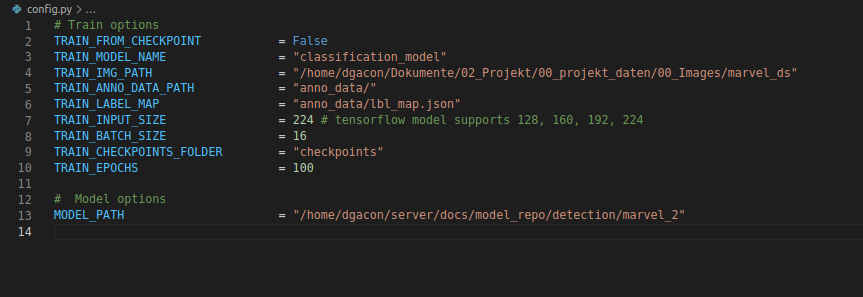

# LOST cls keras

## Description
This Repo is used to train a Tensorflow Keras model to use it with [lost_semi_auto_pipes](https://github.com/l3p-cv/lost_semi_auto_pipes) Repo.
The description and the default options are only to train a Tensorflow Keras "MobilNet" model. To train an other model
look at [Keras](https://keras.io/api/applications/).

## Installation
First, clone or download this GitHub repository and install requirements.
```
pip install -r ./requirements.txt
```


## Data
To train the model you need:
*   annotation data as parquet file

You get annotation data after the first iteration of ["request_triton_mia_loop"](https://github.com/l3p-cv/lost_semi_auto_pipes/blob/main/README.md#request_triton_mia_loop) pipeline.

directory structure:
```
.
├── Images
├── anno_data
│   ├── anno_data_0.parquet
│   ├── anno_data_1.parquet
│   └── lbl_map.json
├── checkpoints
│   ├── checkpoint
│   ├── model_name.data-00000-of-00001
│   └── model_name.index
├── LICENSE
├── CHANGELOG.md
├── config.py
├── README.md
├── requirements.txt
└── train.py
```

## Edit the configs

To train your model, edit the [config.py](config.py)



* [line 2:](config.py#L2) If it is the first training of the model set it false else true
* [line 3:](config.py#L3) Name of the model.
* [line 4:](config.py#L4) Path of the image dataset
* [line 5:](config.py#L5) Path of annotation data parquet file. Create this folder for all your annotation parquet files.
* [line 7:](config.py#L7) Image size to scale for training. MobilNet model supports 128, 160, 192 and 224
* [line 8:](config.py#L8) Choose image batch size per training epoch.
* [line 10:](config.py#L10) Choose the number of training epochs.
* [line 13:](config.py#L13) Path of your model repo.

## Training process

1. download anno_data.parquet from data export of ["request_triton_mia_loop"](https://github.com/l3p-cv/lost_semi_auto_pipes/blob/main/README.md#request_triton_mia_loop) pipeline
2. load or add your anno_data.parquet into your created [directory](config.py#L5)
3. run [train.py](train.py)
   * train the model and save the weights for best model at the checkpoints directory
   * save the model as a TensorFlow model
   * check the model directory for older versions
   * save the new model version with one counter higher as the version befor

